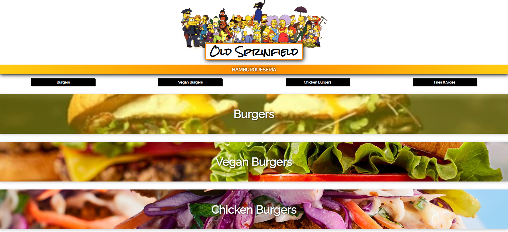
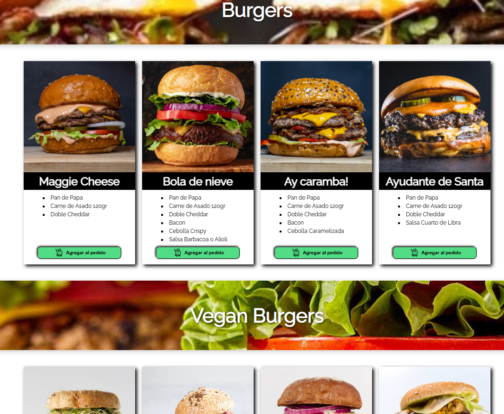
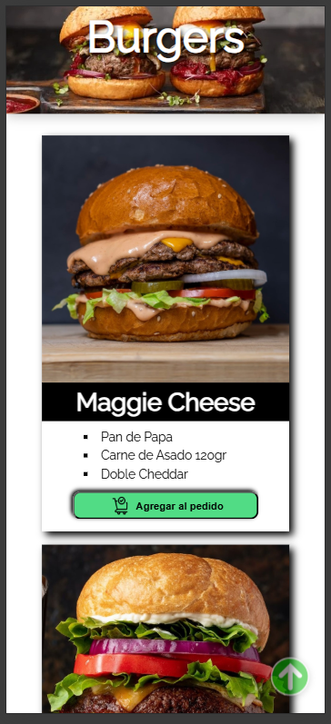
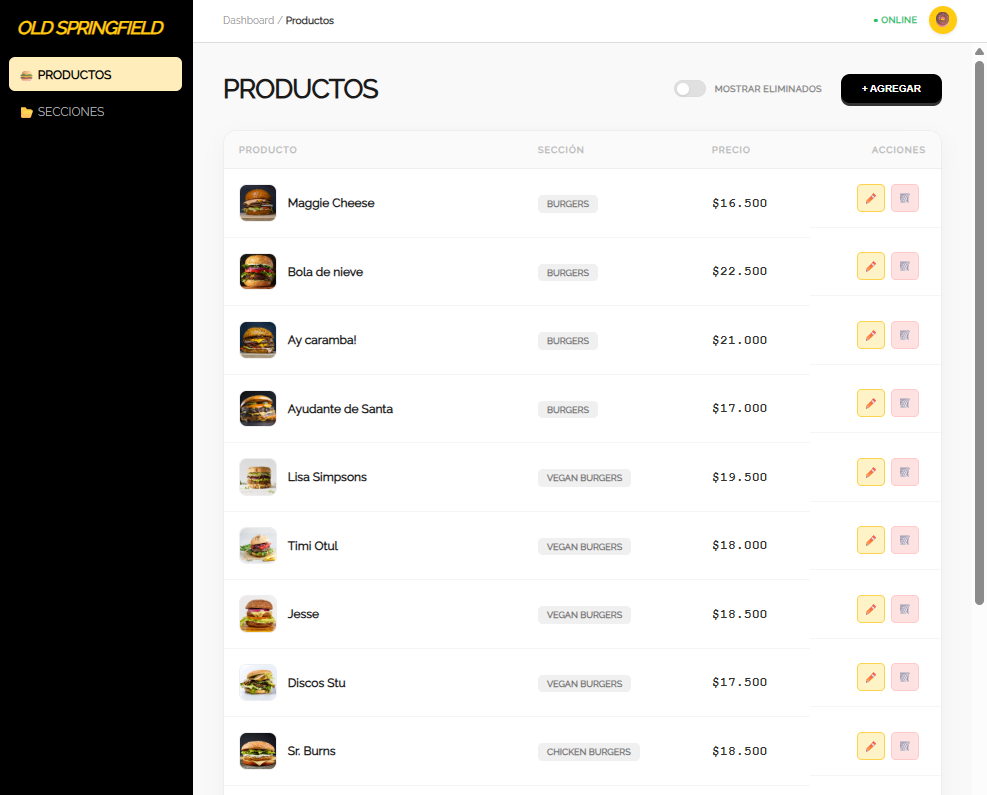
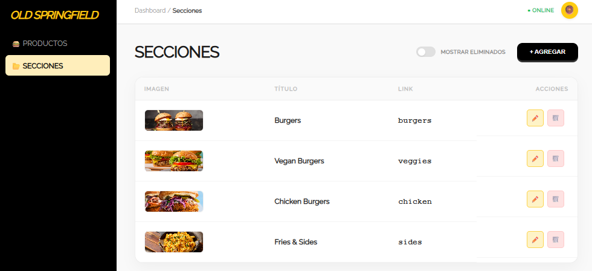
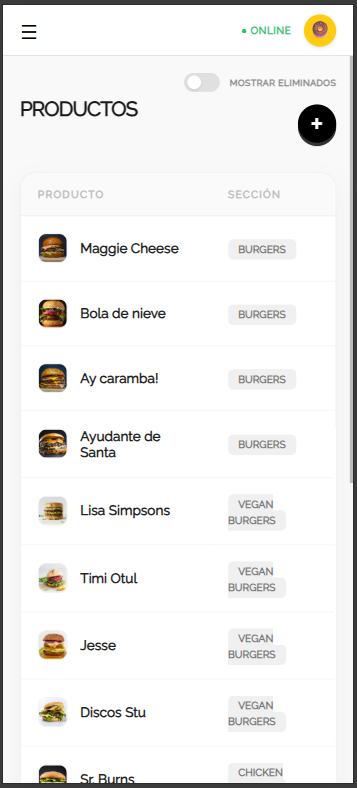

# Old Springfield - Sistema de Gestión de Menú Digital

## Descripción del Proyecto
**Old Springfield** es una plataforma integral de gestión de menús digitales diseñada específicamente para el sector gastronómico. El sistema permite la administración en tiempo real de secciones y productos a través de un panel de administración intuitivo, reflejando los cambios automáticamente en el menú público.

Este proyecto fue desarrollado con el objetivo de optimizar la actualización de menús, eliminando la necesidad de cambios manuales y garantizando una experiencia de usuario fluida y reactiva.

## Stack Tecnológico

* **Frontend:** React.js con renderizado dinámico.
* **Backend:** Node.js con Express.
* **Base de Datos:** MongoDB.
* **Contenedores:** Docker & Docker Compose (para gestión del entorno de base de datos).
* **Herramientas de automatización:** Concurrently para el manejo de procesos paralelos.

---

## Características Principales

* **Panel de Administración:** Interfaz completa para realizar operaciones CRUD (Crear, Leer, Actualizar, Borrar) sobre todas las secciones y productos.
* **Arquitectura de Micro-Entornos:** Separación clara entre cliente y servidor.
* **Persistencia Automatizada:** Base de datos persistente mediante contenedores Docker, garantizando un entorno de desarrollo consistente.
* **Desarrollo Eficiente:** Configuración de scripts raíz para el despliegue simultáneo del stack completo.

---

## Guía de Instalación y Ejecución

### Requisitos Previos

1. **Docker Desktop:** Asegúrate de que esté iniciado antes de ejecutar cualquier comando.
2. **Node.js:** Instalado en tu equipo (versión LTS recomendada).

### Pasos para levantar el entorno

1. **Clonar el repositorio:**

   ```bash
   git clone [TU_URL_DEL_REPOSITORIO]
   cd [NOMBRE_DE_LA_CARPETA]
   ```

2. **Instalar dependencias:**

   Ejecuta el comando en la raíz del proyecto para instalar las herramientas necesarias:

   ```bash
   npm install
   ```

3. **Ejecutar el proyecto:**

   * **Inicio completo (Docker + Backend + Frontend):**

     ```bash
     npm start
     ```

   * **Inicio rápido (Si el contenedor de BD ya está corriendo):**

     ```bash
     npm run dev
     ```

4. **Detener servicios:**

   Para cerrar el entorno de manera limpia y apagar el contenedor:

   ```bash
   npm run docker:down
   ```

---

## Notas para el Desarrollador

La estructura del proyecto utiliza `concurrently` para gestionar los procesos de desarrollo simultáneamente, permitiendo ver los logs tanto del backend como del frontend en una única terminal.

Los scripts personalizados centralizan la gestión del ciclo de vida de los contenedores Docker, facilitando el flujo de trabajo entre el desarrollo y las pruebas de la base de datos.

---

## 📷 Galería









---

## 👨‍💻 Autor

* **[Cristian Gonzalez]** - Desarrollador Full Stack